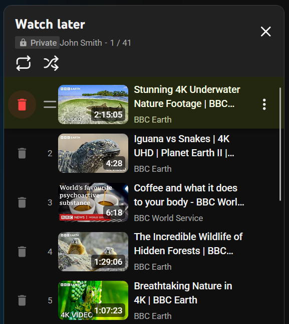
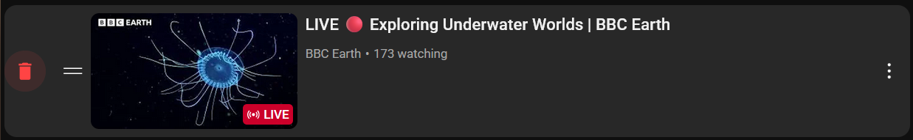

# YouTube Watch Later Quick Remove for Firefox

One-click remove button for YouTube Watch Later playlist.

*Watch page:*

*Playlist page:*

## Install

**Firefox Add-ons Store:** [Install Extension](https://addons.mozilla.org/en-US/firefox/addon/yt-watchlater-quick-rmv/)

**Manual Install:**
1. Download/clone this repo
2. Firefox: `about:debugging` → Load Temporary Add-on → select `manifest.json`
3. Go to your [Watch Later playlist](https://www.youtube.com/playlist?list=WL)

## Usage

Hover over videos → click trash icon → done
